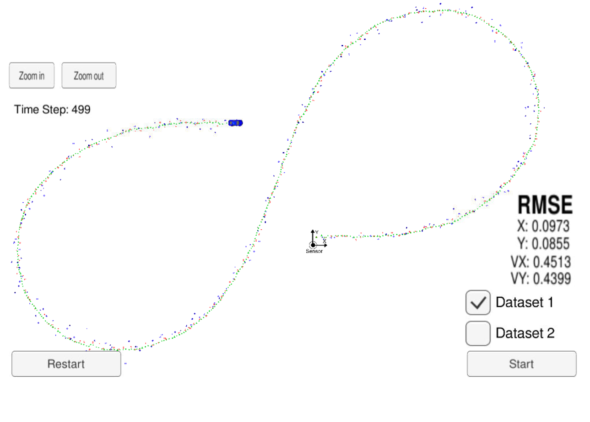
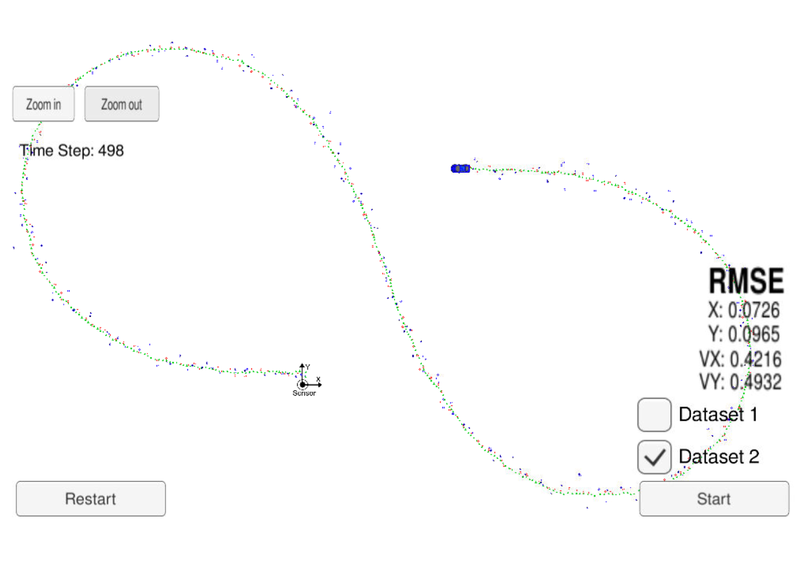
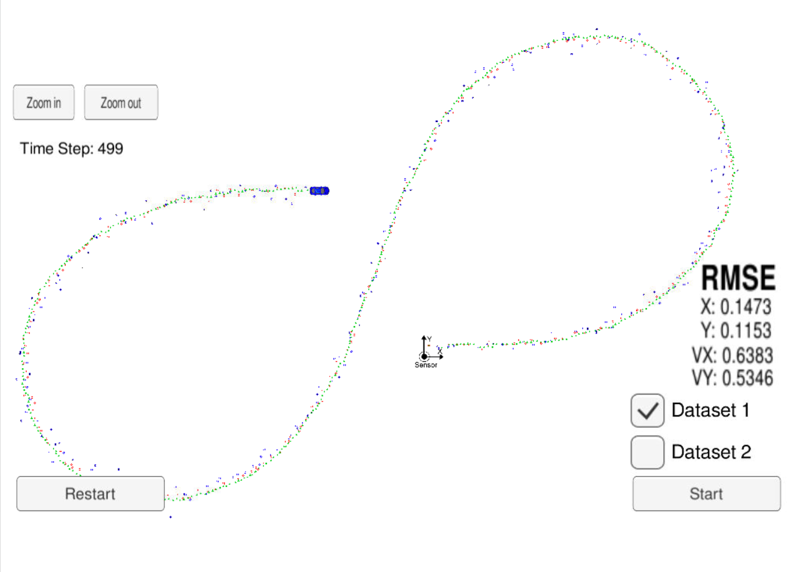
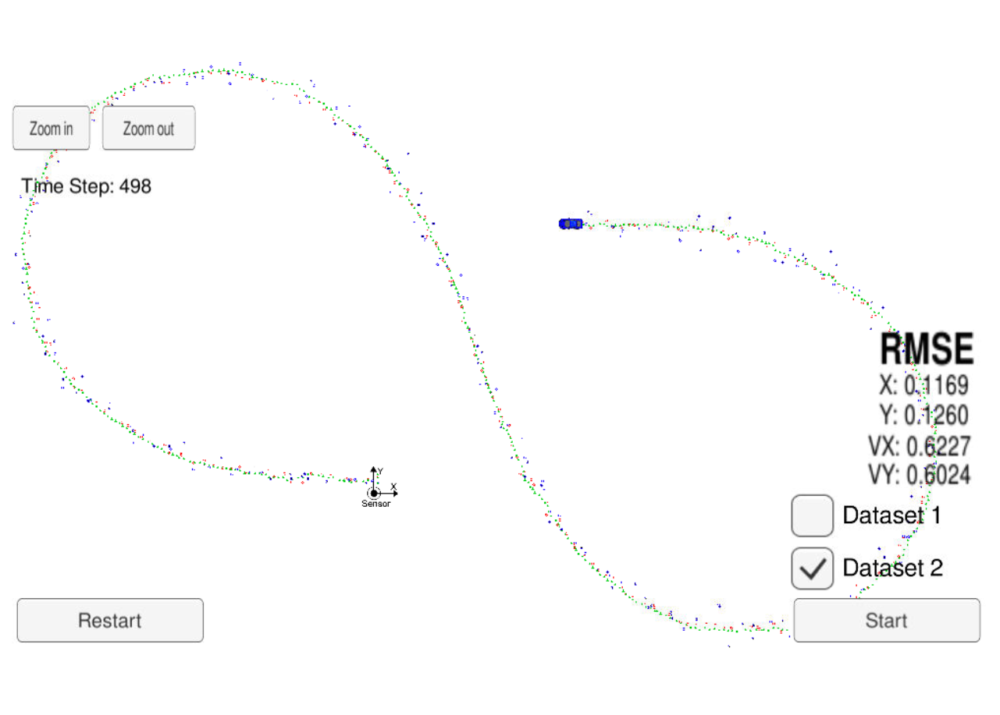
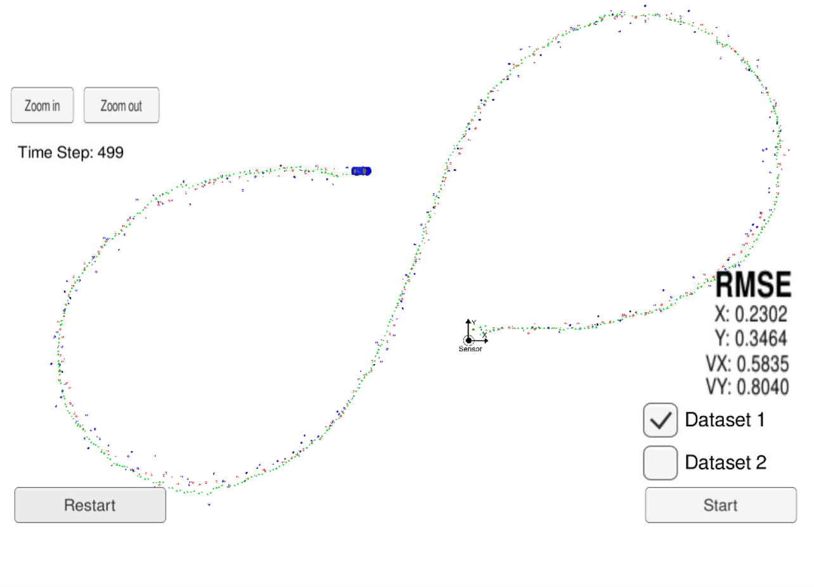
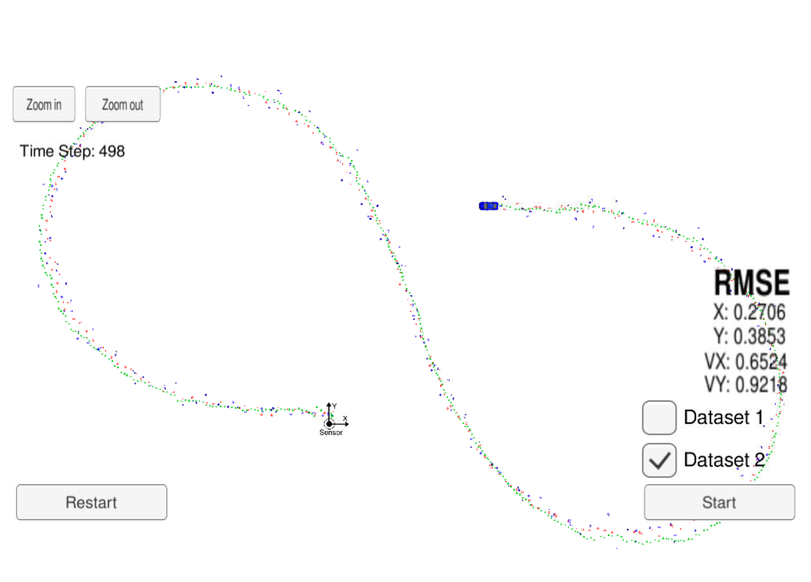

# Self-Driving Car Engineer Nanodegree

## Project: **Extended Kalman Filter**

The goals / steps of this project are the following:

* Build an Extended Kalman Filter for tracking a pedestrian.

* Familiarize myself with C++ coding.

* Test that the EKF on a provided simulator.

* Summarize the results with a written report.

## Rubric Points

---
### Project Overview

The present work has used a simulator to provide Lidar and Radar measurement data from the position and speed of a moving pedestrian. It was implemented an [Extended Kalman Filter](https://en.wikipedia.org/wiki/Extended_Kalman_filter) in order to estimate a future position and speed of the pedestrian following each measurement. When Lidar data was provided, a Standard Kalman Filter was run. When Radar data was provided, an Extended Kalman Filter was used.

The key metrics optimized were [RMSE](https://en.wikipedia.org/wiki/Root-mean-square_deviation) (root-mean-square error) values for both position and speed of the tracked pedestrian. The maximum RMSE values acceptable for this project for [Dataset 1](https://github.com/udacity/CarND-Extended-Kalman-Filter-Project/blob/master/data/obj_pose-laser-radar-synthetic-input.txt) are:

- `0.11` for `Px` and `Py`.
- `0.52` for `Vx` and `Vy`.

### Results

#### 1. Sensor Fusion (Lidar and Radar)

Using Sensor Fusion for the Lidar and Radar measurement data and conducting an Extended Kalman Filter, the RMSE obtained for the dataset 1 were bellow the threshold required for both position and speed parameters.

The folowing table lists the results for both datasets:

| RMSE | Dataset 1 | Dataset 2 |
|------|-----------|-----------|
|  Px  |   0.0973  |   0.0729  |
|  Py  |   0.0855  |   0.0965  |
|  Vx  |   0.4513  |   0.4216  |
|  Vy  |   0.4399  |   0.4932  |

Figures 1 and 2 present the trajectories performed by the vehicle for datasets 1 and 2, respectively.

Figure 1: Dataset 1               |Figure 2: Dataset 2
:--------------------------------:|:--------------------------------:
 |

#### 2. Only Lidar Measurements

The folowing table lists the results for both datasets:

| RMSE | Dataset 1 | Dataset 2 |
|------|-----------|-----------|
|  Px  |   0.1473  |   0.1169  |
|  Py  |   0.1153  |   0.1260  |
|  Vx  |   0.6383  |   0.6227  |
|  Vy  |   0.5346  |   0.6024  |

Figures 3 and 4 present the trajectories performed by the vehicle for datasets 1 and 2 taking into consideration only Lidar measurements, respectively.

Figure 3: Dataset 1                        |Figure 4: Dataset 2
:-----------------------------------------:|:-----------------------------------------:
 |

#### 3. Only Radar Measurements

The folowing table lists the results for both datasets:

| RMSE | Dataset 1 | Dataset 2 |
|------|-----------|-----------|
|  Px  |   0.2302  |   0.2706  |
|  Py  |   0.3464  |   0.3853  |
|  Vx  |   0.5835  |   0.6524  |
|  Vy  |   0.8040  |   0.9218  |

Figures 5 and 6 present the trajectories performed by the vehicle for datasets 1 and 2 taking into consideration only Radar measurements, respectively.

Figure 5: Dataset 1                        |Figure 6: Dataset 2
:-----------------------------------------:|:-----------------------------------------:
 |

### Discussion

Sensor Fusion has proven to be a powerfull tool to achieve accurate object tracking. The RMSE values are below 10% for position and 50% for speed for both datasets. Running with only Lidar and Radar data has shown that none of them is capable to achieve such accuracy by itself. 

Lidar-only has provided better results than Radar-only measurements. This might be due its better detection of small objects.
